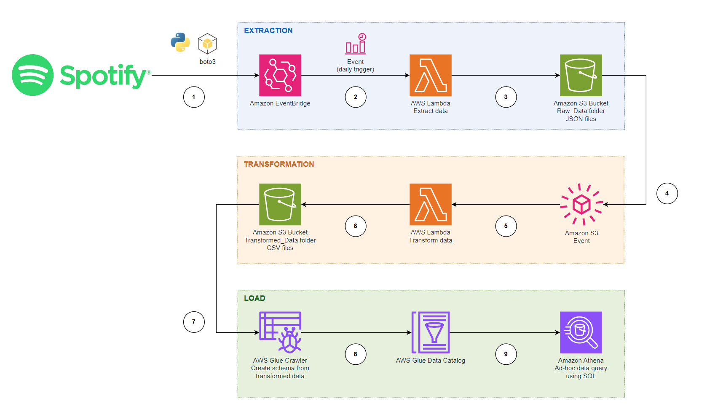

# Spotify data pipeline tutorial

This project aims to build a serverless extract, transform, and load (ETL) pipeline on Spotify data.

## Architecture 

The workflow illustrated in the diagram consists of these high-level steps:

1. At a predefined schedule (e.g. daily), an **AWS Lambda function** uses Python scripts to connect to Spotify's API to fetch the raw data in JSON format.
1. A daily schedule using **Amazon EventBridge** will trigger the **AWS Lambda Data Extraction** function (`spotify_api_data_extract.py`).
1. The AWS Lambda Data Extraction function collects the raw JSON files and stores them in in a "raw_data/to_process" folder on the **Amazon S3** bucket.
1. Any new data added in Amazon S3 bucket creates a new event trigger.
1. The Amazon S3 event will trigger another AWS Lambda function called **Data Transformation function** (`spotify_transformation_load_function.py`). This function will clean and transform raw data to CSV files.
1. The Data Transformation function will save the transformed CSV data back to Amazon S3, but in a different location called "transformed_data" folder to distinguish it from the raw data.
1. An **AWS Glue Crawler** creates the schema from the transformed file stored in Amazon S3.
1. The resulting schema is stored in **AWS Glue Data Catalog**.
1. The schema can be used by any analytics job by using **Amazon Athena** to run ad-hoc queries.